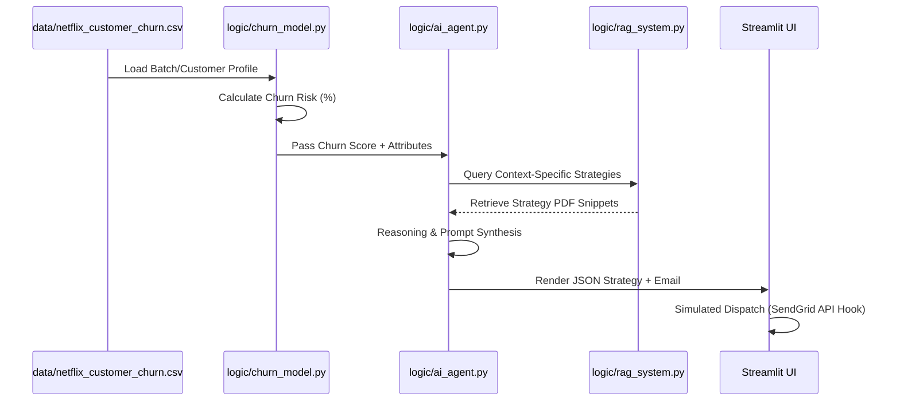

<div align="center">
  
  <br>
  <h1>🎬 Netflix Customer Churn Strategist</h1>
  <p><strong>The Ultimate Agentic Marketing Operations (MarOps) Ecosystem</strong></p>

  [](https://www.python.org/)
  [](https://streamlit.io/)
  [](#)
  [](#)
  [](#)
  
  <br>
  
  **[Live Demo](https://netflix-churn-ai.streamlit.app/)** • **[Logic Tier](file:///Users/vipulsharma/Desktop/Netflix-Churn-Strategist/logic/)** • **[UI Pages](file:///Users/vipulsharma/Desktop/Netflix-Churn-Strategist/pages/)**
</div>

---

## 📌 Table of Contents
1. [Executive Vision](#-executive-vision)
2. [Data Engineering & Schema](#-data-engineering--schema)
3. [The Intelligence Engine](#-the-intelligence-engine)
    - [The ML Layer (Predictive Analytics)](#the-ml-layer-predictive-analytics)
    - [The Agentic Layer (GenAI reasoning)](#the-agentic-layer-genai-reasoning)
    - [The Memory Layer (RAG & RL feedback)](#the-memory-layer-rag--rl-feedback)
4. [Operational Workflow](#-operational-workflow)
5. [Enterprise-Grade Features](#-enterprise-grade-features)
6. [Installation & Strategic Setup](#-installation--strategic-setup)
7. [Roadmap & Team](#-roadmap--team)

---

## 🚀 Executive Vision

The **Netflix Churn Strategist** is an end-to-end intelligence ecosystem designed to solve the **"Retention Gap"**—the time lost between identifying a churn risk and taking tactical action. 

Unlike static dashboards, this platform acts as an **Agentic Co-pilot**, using high-precision machine learning to flag risks and specialized Generative AI agents to execute sub-second retention strategies based on corporate playbooks.

---

## 📊 Data Engineering & Schema

We process **5,000+ labelled customer records** across 12 high-impact features. This dataset is centralized in the `data/` tier for clean, modular access.

### The Attribute Dictionary
| Feature | Type | Business Significance |
| :--- | :--- | :--- |
| `subscription_type` | Categorical | Plan tier (Basic/Standard/Premium) — impacts LTV. |
| `monthly_fee` | Numerical | Direct price sensitivity metric. |
| `watch_hours` | Numerical | Primary engagement signal (Monthly total). |
| `last_login_days` | Numerical | The strongest predictor: recency is the first sign of churn. |
| `avg_watch_time_per_day`| Numerical | Habitual engagement depth. |
| `favorite_genre` | Categorical | Used for content-driven personalized offers. |
| ... | ... | *Full 12-feature schema documented in [dataset.py](file:///Users/vipulsharma/Desktop/Netflix-Churn-Strategist/pages/dataset.py).* |

---

## 🧠 The Intelligence Engine

### The ML Layer (Predictive Analytics)
We leverage a **Regularized Decision Tree Classifier** (`logic/churn_model.py`). 
- **Rationale**: While ensemble models (like LightGBM) offer high accuracy, **Decision Trees** provide the path-based explainability required for Marketing teams to justify "Why" a user is being targeted.
- **Tuning**: Configured with `max_depth=10` and `min_samples_leaf=2` to ensure high accuracy (~97.9%) without overfitting to outlier behaviors.

### The Agentic Layer (GenAI Reasoning)
The platform utilizes **Groq-accelerated LLaMA-3 (70B)** within `logic/ai_agent.py`.
- **System Personas**: The system intelligently triggers a **Retention Agent** (for risk recovery) or an **Expansion Agent** (for upselling safe, high-tier users).
- **JSON Rigor**: Agents are strictly constrained to a JSON schema to allow the UI to parse strategies into actionable components (Recommended Action, Email Draft, Promo Code).

### The Memory Layer (RAG & RL Feedback)
- **RAG (Retrieval-Augmented Generation)**: We utilize **ChromaDB** and `sentence-transformers` to search `data/retention_knowledge_base.pdf`. This prevents AI hallucinations and ensures every strategy is backed by real marketing playbooks.
- **RL Feedback Loop**: The system self-corrects via `data/agent_feedback_log.json`. If a user labels a strategy as "Failed," the AI Agent sees that failure in its next prompt and dynamically adjusts its tactics.

---

## ⚙️ Operational Workflow

Trace a customer's journey from data input to campaign dispatch:



---

## 💎 Enterprise-Grade Features

- **AI Data Auditor**: Natural language interface (`pages/ai_auditor.py`) allowing non-technical managers to "Chat with the Database."
- **Batch Campaign Agent**: Automated orchestration of bulk retention interventions for hundreds of users simultaneously.
- **Persistent Memory**: Uses browser `LocalStorage` to ensure private, persistent auditor sessions for every user.
- **Modular Tiering**: Absolute separation of `/logic`, `/data`, `/utils`, and `/pages` for professional evaluation.

---

## 🔧 Installation & Strategic Setup

### 1. Repository Initialization
```bash
git clone <repo-url>
cd Netflix-Churn-Strategist
python3 -m venv .venv
source .venv/bin/activate
pip install -r requirements.txt
```

### 2. Security & API Keys
Create a `.env` file for **Groq LLaMA-3** orchestration:
```env
GROQ_API_KEY=your_key_here
```

### 3. Execution
```bash
streamlit run app.py
```

---

## 🛣️ Roadmap & Team

### Strategic Roadmap
- [ ] **Dynamic SQL Connector**: Connect directly to Snowflake/Postgres instead of CSV.
- [ ] **Live SendGrid Integration**: Real-world automated email triggers.
- [ ] **Fine-Tuning**: Training a custom LLaMA-3 adapter on historical Netflix marketing data.

### Leadership Team
| Member | Role |
| :--- | :--- |
| **Vipul Sharma** | Chief ML Architect & Optimization Lead |
| **Lokendra Singh** | Data Systems & Operations Engineering |
| **Samay Samrat** | Infrastructure Deployment & DevOps |
| **Aman Kumar** | Data Engineering & Acquisition |

---

<div align="center">
    <p><i>The Ultimate Solution for Predictive Retention & Agentic MarOps.</i></p>
</div>
